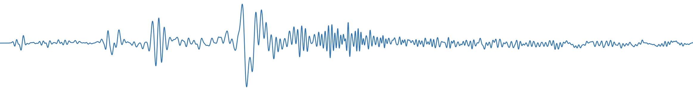
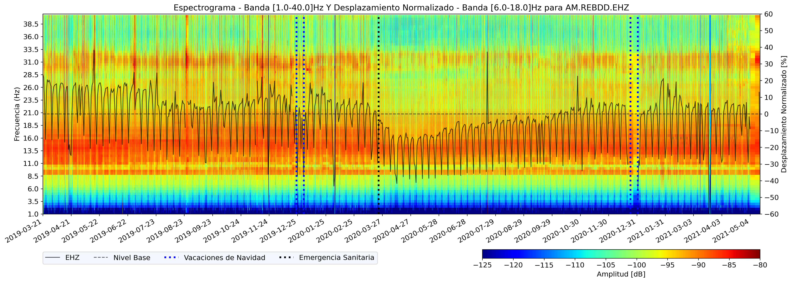
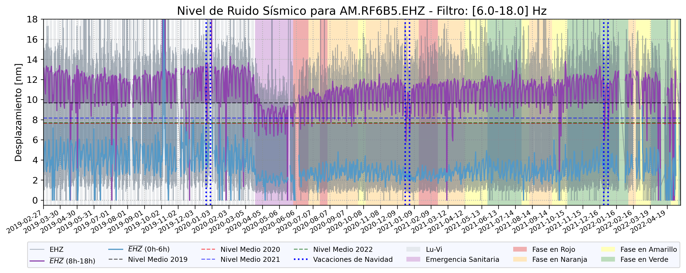
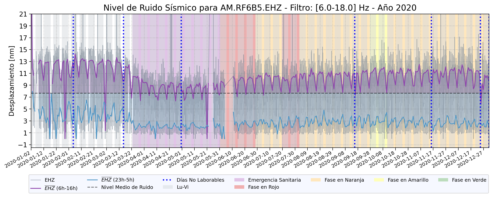
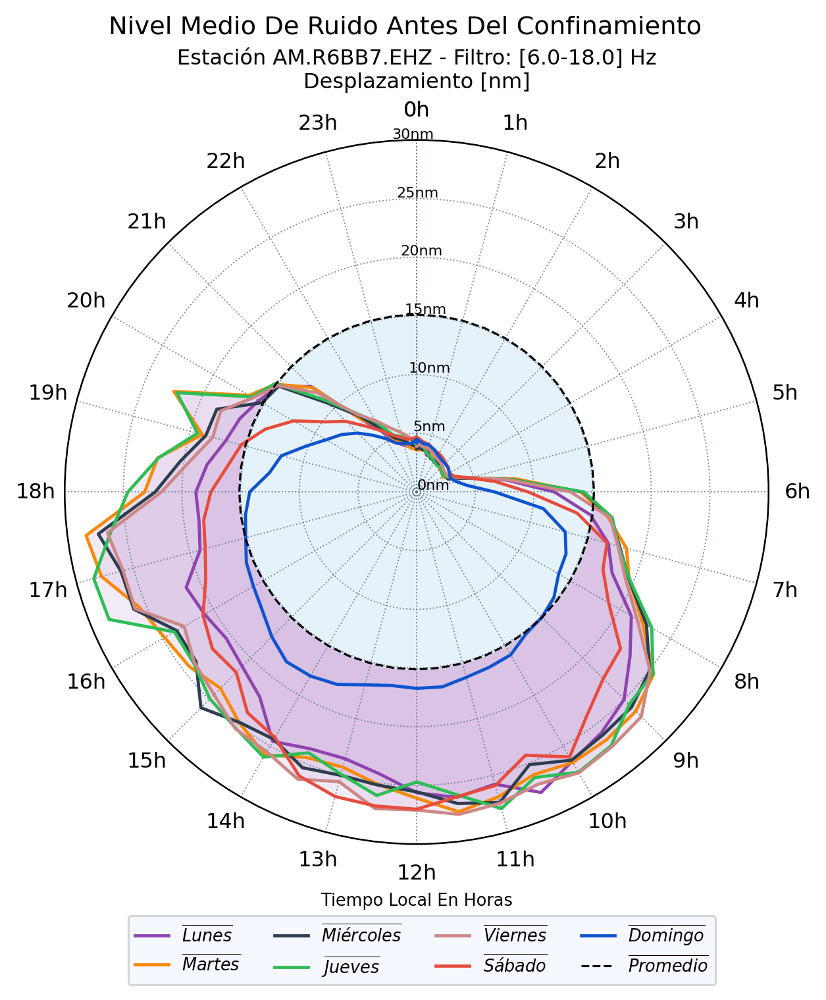
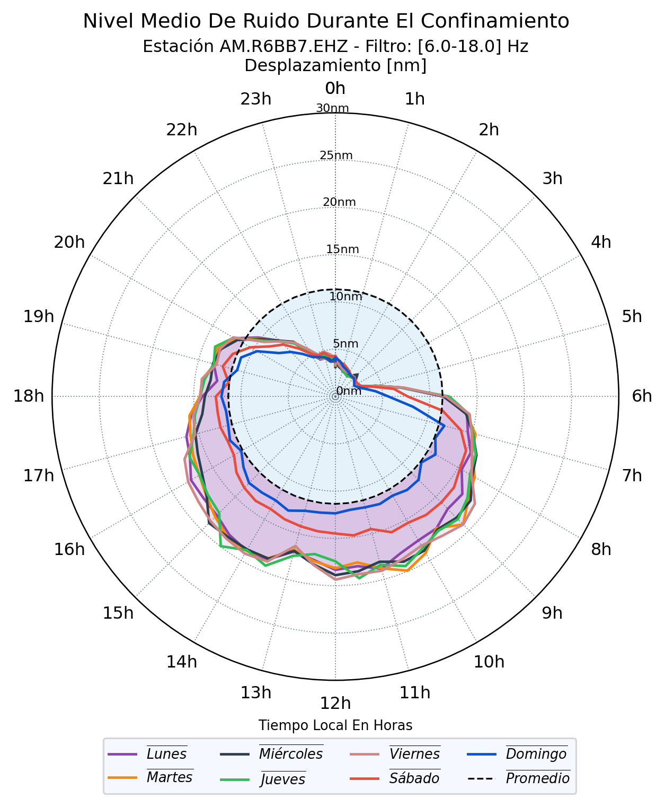
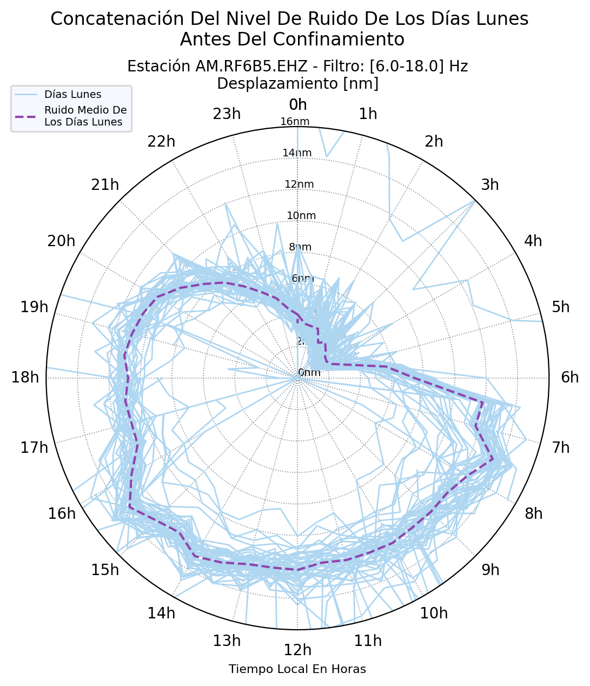

# Análisis del ruido sísmico y su correlación con el confinamiento por COVID-19 en la ciudad de Querétaro, México. 

## Contenido
*Este repositorio contiene los Jupyter Notebooks utilizados en mi tesis, los cuales han sido fundamentales para el procesamiento de ruido sísmico y la obtención de las figuras necesarias. El objetivo principal de este estudio es analizar la relación entre la actividad antropogénica y las variaciones en el ruido sísmico durante el período de confinamiento por COVID-19 en la zona metropolitana sur de Querétaro, México.*

Se requiere:

- Python
- ObsPy (y sus dependencias)
- Pandas
- NumPy
- Matplotlib
- Google Colab

El repositorio consta de dos cuadernos de trabajo, dentro de [Cálculo de PPSD](Calculo_PPSD.ipynb) se tiene el cálculo de los PPSD y de los RMS sísmicos, para ser exportados en archvios .cvs. Y mediante diversas ténicas de análisis en el cuaderno de trabajo [Figuras](Figuras.ipynb) se lleva a cabo la vizualización de los RMS sísmicos, obteniendo figuras como:

- Espectrograma de potencia y desplazamiento normalizado

- RMS del desplazamiento sísmico con las fases del semáforo epidemiológico

- También con una resolución de cada año de datos

- Diagramas de reloj para observar el comportamiento del nivel de ruido por hora y día de la semana

  
  

- La concatenación del ruido diario para el calculo de el ruido medio diario

  
## Instalación
Este proyecto no requiere una instalación específica, ya que los Jupyter Notebooks pueden ejecutarse en entornos locales o en servicios en la nube compatibles con Python como Google Colab.

## Contribución
Si deseas contribuir en este proyecto:
- Haz un fork de este repositorio y clónalo en tu cuenta de GitHub.
- Crea una nueva rama para tu contribución.
- Realiza tus modificaciones y mejoras.
- Asegúrate de incluir pruebas si es necesario.
- Envía un pull request para revisar tus cambios.

## Licencia 
Este proyecto esta bajo la Licencia de MIT. Consulta el archivo [LICENSE](LICENSE) para mas detalles.

## Contacto
Si tienes alguna pregunta o sugerencia relacionada con este proyecto, puedes contactarme a través de mi correo electrónico: juanpablosanchez110@gmail.com

